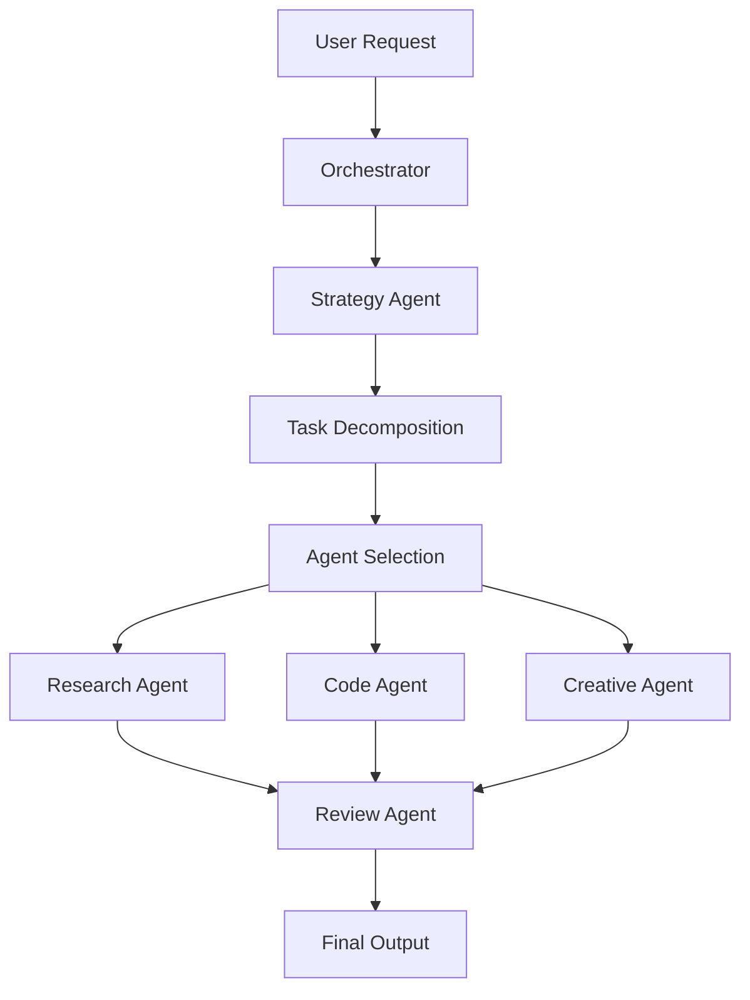

# ISH Automation System - Multi-Agent Orchestrator

A sophisticated multi-agent automation system for the Infinite Story Hackathon (ISH) platform that enables automated interaction, prompt management, and intelligent agent orchestration.

## 🎯 Features

### Core Capabilities
- **Multi-Agent Orchestration**: Coordinate multiple specialized agents for complex tasks
- **Dynamic Model Selection**: Automatically select the best AI model for each task
- **System Prompt Management**: Configure and manage system prompts for different agents
- **Robust Error Handling**: Retry mechanisms and graceful degradation
- **Conversation History**: Track all interactions and agent activities
- **Web Automation**: Playwright-based browser automation for ISH platform

### Available Agents

1. **Strategy Agent** (Claude-3-Opus)
   - Task planning and decomposition
   - Workflow coordination
   - Multi-agent orchestration strategies

2. **Research Agent** (GPT-4)
   - Information gathering
   - Requirement analysis
   - Context building

3. **Code Agent** (Claude-3-Sonnet)
   - Code generation
   - Implementation
   - Testing

4. **Review Agent** (GPT-4-Turbo)
   - Output validation
   - Quality assurance
   - Feedback generation

5. **Creative Agent** (Claude-3-Opus)
   - Creative content generation
   - Storytelling
   - Innovative solutions

## 📦 Installation

```bash
# Clone or create the project directory
mkdir ish-automation
cd ish-automation

# Initialize npm project
npm init -y

# Install dependencies
npm install playwright typescript @types/node winston dotenv

# Install Playwright browsers
npx playwright install chromium
```

## 🚀 Quick Start

### Basic Usage

```javascript
const { ISHOrchestrator, ISHAgent } = require('./orchestrator');

// Initialize the orchestrator
const orchestrator = new ISHOrchestrator({
    headless: true,
    timeout: 30000
});

await orchestrator.initialize();

// Send a simple prompt
const response = await orchestrator.sendPromptToISH(
    'Write a story about AI',
    {
        model: 'claude-3-opus',
        systemPrompt: 'You are a creative writer.'
    }
);
```

### Multi-Agent Task

```javascript
// Orchestrate a complex task with multiple agents
const results = await orchestrator.orchestrateTask(
    'Create a web application for task management'
);

console.log('Results:', results);
```

### Custom Agent Creation

```javascript
// Create a custom agent
const customAgent = new ISHAgent('DataAnalyst', {
    model: 'gpt-4',
    systemPrompt: 'You are a data analysis expert.',
    capabilities: ['analysis', 'visualization', 'statistics'],
    temperature: 0.3
});

// Register with orchestrator
orchestrator.registerAgent(customAgent);

// Use the agent
const analysis = await customAgent.process(
    'Analyze this dataset',
    { data: [...] }
);
```

## 🏗️ Architecture

```
ish-automation/
├── orchestrator.js       # Main orchestrator system
├── example.js           # Basic usage example
├── agents/              # Agent history storage
│   └── *-history.json
├── screenshots/         # Debug screenshots
└── conversation-history.json
```

### System Flow



## 🔧 Configuration

### Orchestrator Options

```javascript
const config = {
    headless: true,           // Run browser in headless mode
    timeout: 60000,          // Request timeout in ms
    retryCount: 3,           // Number of retry attempts
    retryDelay: 2000         // Delay between retries in ms
};

const orchestrator = new ISHOrchestrator(config);
```

### Model Registry

The system includes pre-configured models:

| Model | Provider | Context Window | Best For |
|-------|----------|---------------|----------|
| claude-3-opus | Anthropic | 200K | Complex reasoning, creativity |
| claude-3-sonnet | Anthropic | 200K | Code generation, analysis |
| gpt-4 | OpenAI | 128K | General tasks, research |
| gpt-4-turbo | OpenAI | 128K | Vision, multimodal tasks |
| gemini-pro | Google | 32K | Multimodal analysis |
| llama-3-70b | Meta | 8K | Open-source tasks |

## 📝 API Reference

### ISHOrchestrator

#### Methods

**initialize()**
Initialize the orchestrator and browser
```javascript
await orchestrator.initialize();
```

**registerAgent(agent)**
Register a new agent
```javascript
orchestrator.registerAgent(myAgent);
```

**orchestrateTask(task, strategy)**
Execute a task with multiple agents
```javascript
const results = await orchestrator.orchestrateTask(
    'Build a REST API',
    'sequential' // or 'parallel'
);
```

**selectBestModel(taskType, requirements)**
Select the optimal model for a task
```javascript
const model = await orchestrator.selectBestModel('coding', {
    capabilities: ['coding', 'debugging'],
    contextSize: 50000
});
```

**sendPromptToISH(prompt, config)**
Send a prompt to the ISH platform
```javascript
const response = await orchestrator.sendPromptToISH(
    'Your prompt here',
    {
        model: 'claude-3-opus',
        systemPrompt: 'Custom instructions',
        temperature: 0.7,
        maxTokens: 2000
    }
);
```

### ISHAgent

#### Constructor Options

```javascript
const agent = new ISHAgent('AgentName', {
    model: 'claude-3-opus',        // AI model to use
    systemPrompt: 'Instructions',   // System prompt
    temperature: 0.7,               // Response randomness (0-1)
    maxTokens: 2000,               // Maximum response tokens
    capabilities: ['task1', 'task2'] // Agent capabilities
});
```

#### Methods

**process(prompt, context)**
Process a task with the agent
```javascript
const result = await agent.process(
    'Task description',
    { additionalContext: {...} }
);
```

## 🎯 Use Cases

### 1. Complex Project Generation
```javascript
await orchestrator.orchestrateTask(
    'Create a full-stack e-commerce platform with React and Node.js'
);
```

### 2. Code Review and Optimization
```javascript
const codeAgent = orchestrator.agents.get('CodeAgent');
const reviewAgent = orchestrator.agents.get('ReviewAgent');

const code = await codeAgent.process('Generate authentication system');
const review = await reviewAgent.process('Review this code', { code });
```

### 3. Research and Documentation
```javascript
const researchAgent = orchestrator.agents.get('ResearchAgent');
const research = await researchAgent.process(
    'Research best practices for microservices architecture'
);
```

## 🔍 Debugging

### Enable Debug Mode
```javascript
const orchestrator = new ISHOrchestrator({
    headless: false,  // Show browser window
    timeout: 120000   // Longer timeout for debugging
});
```

### Check Logs
- Agent histories: `ish-automation/agents/*-history.json`
- Conversation history: `ish-automation/conversation-history.json`
- Screenshots: `ish-automation/screenshots/`

## ⚠️ Important Notes

1. **ISH Platform Access**: The system requires access to https://ish.junioralive.in/
2. **Browser Automation**: Uses Playwright for web automation
3. **Model Availability**: Actual model access depends on ISH platform availability
4. **Rate Limiting**: Be mindful of platform rate limits
5. **Error Handling**: The system includes retry mechanisms but may fail if the platform is unavailable

## 🔄 Next Steps

### Enhancements to Consider

1. **API Integration**: Direct API integration when available
2. **WebSocket Support**: Real-time communication with ISH
3. **Plugin System**: Extensible agent capabilities
4. **Caching Layer**: Response caching for efficiency
5. **Monitoring Dashboard**: Real-time agent monitoring
6. **Parallel Execution**: True parallel agent execution
7. **Memory System**: Long-term memory for agents
8. **Fine-tuning Support**: Custom model fine-tuning

### Contributing

To extend the system:

1. Create new agents by extending `ISHAgent`
2. Add new models to the model registry
3. Implement custom orchestration strategies
4. Add new capabilities to existing agents

## 📄 License

MIT License - Feel free to use and modify as needed.

## 🤝 Support

For issues or questions:
- Check the conversation history for debugging
- Review agent logs in the agents directory
- Ensure ISH platform is accessible
- Verify all dependencies are installed

---

Built with ❤️ for automating the Infinite Story Hackathon platform